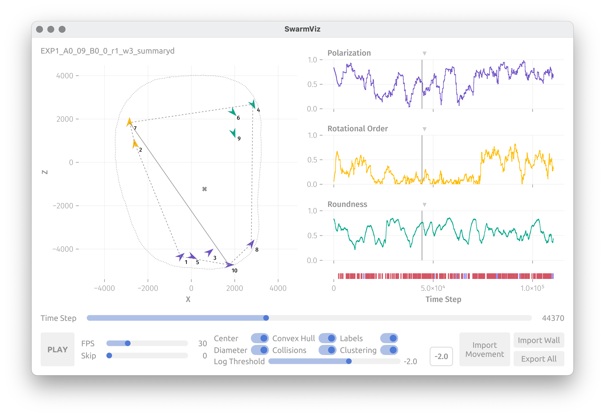

# SwarmViz

> A simple GUI-based visualization tool for movement data of Swarms.

Interactively visualize tracking or simulated data of collective movement while monitoring an array of useful metrics. Includes a hierarchical clustering based on distance and orientation as and supports both automatic playback and scrubbing through the time steps. All calculated data can be exported into modern file formats for further analysis.



## Installation

### Compiled Binaries

Download the binary for your operating system from the [TU-Berlin DepositOnce](https://doi.org/10.14279/depositonce-20001). Unpack the archive to a location of your choice, then navigate to ```SwarmViz/bin``` and double-click on the executable named ```SwarmViz```.

Depending on what libraries are installed on your system, it might be necessary to download additional dependencies on startup. On some operating systems you are not notified of this in any way. Make sure you have an active internet connection and wait for several minutes for the download to finish.

### Running as a Script

Install the Julia programming language from [julialang.org](julialang.org) or a package manager of your choice and add it to your path. Clone this repository.

Open your terminal and navigate to the directory containing the Project.toml file. Then do

```sh
julia
using Pkg
Pkg.activate(".")
Pkg.instantiate()
using SwarmViz
swarmviz();
```

### Compiling from Source

Install the Julia programming language from [julialang.org](julialang.org) or a package manager of your choice and add it to your path. Clone this repository.

Open your terminal and navigate to the directory containing the Project.toml file. Then do

```sh
julia
using Pkg
Pkg.add("PackageCompiler")
using PackageCompiler
Pkg.activate(".")
Pkg.instantiate()
create_app(".", "path_to_directory_to_compile_to"; incremental=true, executables=["NameOfYourChoice" => "swarmviz"])
```

## Usage

Use the import buttons to load movement data as well as collisions and enclosures matching the specification described in a section below (calculating all metrics might take a moment depending on your system specifications).

Select metrics to monitor from the dropdown menus above the three (empty) graphs on the right.

Either use the “Time Step” slider to move through the data or press the “PLAY” button start playing back the experiment or simulation. The time step slider stays reactive during this and FPS as well as a number of time steps to skip between each frame can be adjusted.

Toggle additional visualization such as the convex hull, collisions or clustering any time. Choose a threshold for the clustering using the slider or enter a specific value in the box above.

See the [Makie documentation](https://docs.makie.org/stable/reference/blocks/axis/index.html#axis_interaction) for additional ways to interact with any of the plots.

After you’re done, hit the export to button to choose a location for all the data that was created.

## Metrics and Clustering

In the following, $\vec{x}_i(t)$ is the position vector of the ith agent at time t and $\vec{n}_i(t)$ is the unit heading vector of the ith agent. $N$ is the total number of agents, $\vec{h}_i(t)$ is the position vector of the ith vertex of the convex hull (ordered by adjacency).

- **Polarization**
$$\frac{1}{N} \left| \left| \sum_{i=1}^N \vec{n}_i(t) \right| \right|$$

- **Rotational Order**
$$\frac{1}{N} \left| \left| \sum_{i=1}^N \left( \vec{x}\_{i} (t) - \frac{1}{N} \sum_{j=1}^N \vec{x}\_j (t) \right) \times \vec{n}_i(t) \right| \right|$$

For these first two also see *Zheng et. al. (2022)*.

- **Mean Interindividual Distance** (IID)

$$\frac{2}{N(N-1)} \sum_{i=1}^N \sum_{0 \lt j \lt i} \left| \left| \vec{x}_i(t) - \vec{x}_j(t) \right| \right|$$

- **Mean Minimum IID**
$$\frac{1}{N} \sum_{i=1}^N \min_{j \neq i} \left| \left| \vec{x}_i(t) - \vec{x}_j(t)\right| \right|$$

- **MaxMin IID**
$$\max_i \min_{j \neq i} \left| \left| \vec{x}_i(t) - \vec{x}_j(t)\right| \right|$$

- **Diameter**
$$\max_{i, j}  \left| \left| \vec{x}_i(t) - \vec{x}_j(t)\right| \right|$$

- **Area**
$$A(t) = \frac{1}{2} \sum_{i} \left( h_{i,1}(t) h_{j,2}(t) - h_{j, 1}(t) h_{i,2}(t) \right), \quad j = (i \mod N) + 1$$

- **Roundness**
$$\frac{4 \pi A(t)}{\sum_{i} \left| \left| \vec{h}_i (t) - \vec{h}_j (t)  \right| \right| }, \quad j = (i \mod N) + 1$$

The clustering is a [hierarchical clustering](https://en.wikipedia.org/wiki/Hierarchical_clustering) based on a dissimilarity matrix with entries constructed as follows:

$$ d_{ij}(t) = 1 - \sqrt{\left(1 - \frac{\left| \left| \vec{x}\_i(t) - \vec{x}\_j(t) \right| \right| }{r_{\text{max}}}\right) \frac{\vec{n}\_i(t) \cdot \vec{n}\_j(t) +1}{2}}$$

where

$$ r_{max} = \max_{i,j,k,l,t_*} \sqrt{\left( x_{i,1}(t_1)-x_{j,1}(t_2) \right)^2 + \left( x_{k,2}(t_3)-x_{l,2}(t_4) \right)^2} $$

## Input Specification

### Movement Data

A single file ending in **summaryd.npy** with **four** dimensions, respectively:

*runs x agents x properties x time steps*

Currently, only a single run is supported, so only the first run will be read.

The first five properties need to be exactly the following, in the specified order:

1. Time [s]
2. X-Coordinate
3. Y-Coordinate
4. Z-Coordinate
5. Heading Angle [radians] (zero to the right)

The Y-Coordinate as well as additional properties will be disregarded.

### Collisions

Two **.json** files with the same filename and location as the movement file, except replacing “summaryd.npy” with

- aarefl.json for the agent-agent collisions
- warefl.json for the agent-wall collisions

respectively. They need to have the following internal structure:

- an outer dictionary with the run number (zero indexed) as strings as keys and values in the form of
  - a dictionary with the agent ID (zero indexed) as a string as keys and values in the form of
    - a list of all time steps (integers, not time points!) where a collision of the respective type occurred

Currently, only a single run is supported, so only the first run will be read.

### Wall/Enclosure Data (Optional)

A single **.npy** with **four** dimensions, respectively:

*runs x agents x properties x time steps*

Currently, only a single run is supported, so only the first run will be read.

1. Time [s]
2. X-Coordinate
3. Y-Coordinate
4. Z-Coordinate

Time, the Y-coordinate as well as additional properties will be disregarded. The tool also assumes that there are no missing time steps, so the index in the tensor corresponds exactly.

## Output Specification

- **agents.parquet** containing a table with all data concerning specific agents. The columns are:
  1. Time [s]
  2. X-Coordinate
  3. Y-Coordinate
  4. Z-Coordinate
  5. Heading Angle [radians]
  6. X-Component of the X-Z Unit Heading Vector
  7. Z-Component of the X-Z Unit Heading Vector
  8. Agent ID (one indexed!)
  9. Cluster Assignment (one indexed!)
- **metrics.parquet** containing a table with global metrics for the entire swarm. Rows correspond to time steps in the original data and the columns are:
  1. Polarization
  2. Rotational Order
  3. Diameter
  4. Area
  5. Roundness
  6. Mean Interindividual Distance
  7. MaxMin Interindividual Distance
  8. Mean Minimum Interindividual Distance
  9. Log Last Merge Threshold (of the Clustering)
- **derived.jld2** containing tensors with derived metrics. It can be accessed by treating it like a regular **HDF5** file but has additional functionality when used with Julia. It contains:
  - X-Z **Distance Matrices** as “distance_matrices” in the shape *agent x agent x time steps*
  - The **IDs** (one indexed!) of the **two most distant agents** as “furthest” in the shape *agents x time steps*
  - The **center of mass** of the agents (assuming equal mass) in the X-Z plane as “center_of_mass” in the shape *coordinates x time steps*
  - A group called “clustering” containing:
    - The **heights = thresholds** of dissimilarity at which merges occur in the clusterings as “clustering_heights” in the shape *merges x time steps*
    - The pairwise **merges** of the clusterings (negative integers denote agent IDs (one indexed!), positive integers cluster IDs by order of creation), ascending by threshold, as “clustering_merges” in the shape *merges x IDs x time step*
    - The **ordering** of the leaves of the hierarchical clustering (“fast optimal ordering” by *Bar-Joseph et. al. (2001)*) as “clustering_order” in the shape *IDs x time steps*
- **convex_hull.json** containing the locations of the vertices of the convex hull of all agents with the internal structure:
  - a list for each timestep where each entry is
    - a list of vertices where each entry is
      - a list with one X and one Z coordinate

## Development setup

Install the current version of the Julia programming language from your preferred source. Then navigate to the project folder in your terminal and run

```sh
julia
using Pkg
Pkg.activate(".")
Pkg.instantiate()
```

## Accessibility

The colors used to denote cluster assignments are suitable for individual with color vision deficiency for up to 6 clusters. The colors for metric plots and collisions always are.

## Meta

Created by Neal McKee while studying at the BCCN Berlin with the Romanczuk Lab at HU Berlin.

Distributed under the MIT-license. See ``LICENSE`` for more information.

## Contributing

1. Fork it (<https://github.com/nealmckee/swarmviz/fork>)
2. Create your feature branch (`git checkout -b feature/fooBar`)
3. Commit your changes (`git commit -am 'Add some fooBar'`)
4. Push to the branch (`git push origin feature/fooBar`)
5. Create a new Pull Request

## Cite this

McKee, N. SwarmViz. Files at <https://doi.org/10.14279/DEPOSITONCE-20001> (2024).

## Citations

Zheng Y, Huepe C, Han Z. Experimental capabilities and limitations of a position-based control algorithm for swarm robotics. Adaptive Behavior. 2022;30(1):19-35. doi:10.1177/1059712320930418

Ziv Bar-Joseph, David K. Gifford, Tommi S. Jaakkola, Fast optimal leaf ordering for hierarchical clustering , Bioinformatics, Volume 17, Issue suppl_1, June 2001, Pages S22–S29, <https://doi.org/10.1093/bioinformatics/17.suppl_1.S22>
